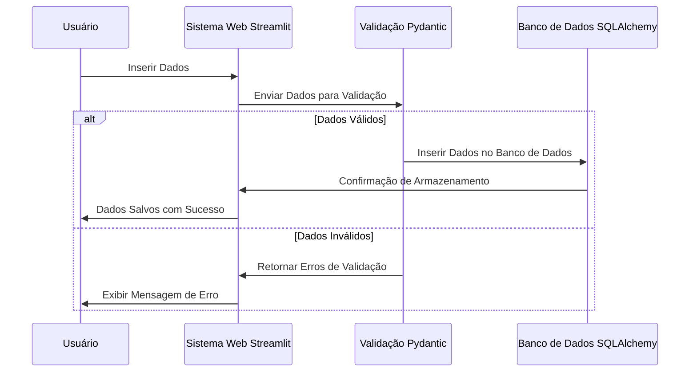

# Sistema de CRM e Vendas da XPTO   [](https://jownao.github.io/genai_streamlit/)
 


O servidor free tier desse projeto já foi desativado, peço para que visualiza o video demonstrativo abaixo ou se quiser entre em contato diretamente comigo.

O [**Sistema de CRM e Vendas da XPTO**](https://vendasgenai.streamlit.app/) é uma aplicação desenvolvida para gerenciar e validar vendas de forma simples e eficiente. A solução oferece um frontend interativo para inserção de dados de vendas e validação robusta, além de uma integração fluida com um banco de dados PostgreSQL. [Assista ao vídeo de demonstração](https://youtu.be/PZpsMNDrUII).

O projeto também conta com a implementação do **Medalhão** utilizando DBT (Data Build Tool) para orquestrar e transformar os dados em diferentes camadas:

- **Bronze**: Armazenamento de dados brutos
- **Silver**: Transformação e padronização dos dados
- **Gold**: Dados prontos para análise e tomadas de decisões

## Funcionalidades

- **Frontend com Streamlit**: Uma interface simples e intuitiva para inserção de dados de vendas.
- **Validação de Dados com Pydantic**: Garantia da integridade dos dados através de validação automática.
- **Integração com PostgreSQL**: Armazenamento seguro e escalável para todas as vendas registradas.





## Estrutura do Projeto

```
Sistema_CRM_Vendas_XPTO
├── docs
│   ├── index.md
├── .gitignore
├── .python-version
├── README.md
├── app.py
├── contracts.py
├── database.py
├── mkdocs.yml
└── requirements.txt
```

## Estrutura de Dados (DBT)

- **Bronze**: Dados brutos extraídos do sistema de vendas, armazenados no arquivo `bronze_vendas.sql`.
- **Silver**: Dados transformados e limpos, prontos para análises mais profundas, disponíveis em `silver_vendas.sql`.
- **Gold**: Dados otimizados para relatórios e insights, divididos em:
  - `gold_vendas_7_dias.sql`: Vendas dos últimos 7 dias.
  - `gold_vendas_por_vendedor.sql`: Vendas agregadas por vendedor.

## Requisitos

- Python 3.12.1
- PostgreSQL
- Pacotes listados no arquivo `requirements.txt`

## Instalação

1. Clone este repositório:

   ```bash
   git clone https://github.com/Jownao/genai_streamlit/
   ```

2. Instale as dependências:

   ```bash
   pip install -r requirements.txt
   ```

3. Configure o banco de dados PostgreSQL no arquivo `.env`:

   ```
   DB_HOST=localhost
   DB_NAME=nome_do_banco
   DB_USER=usuario
   DB_PASS=senha
   ```

4. Execute a aplicação:

   ```bash
   streamlit run app.py
   ```

## Funcionalidades Detalhadas

### Frontend (`app.py`)

O frontend foi desenvolvido usando **Streamlit**, e oferece os seguintes campos para inserção de dados:

- **Email do vendedor**: Validação de formato de email.
- **Data e hora da compra**: Campos interativos para data e hora.
- **Valor da venda**: Aceita apenas valores positivos.
- **Quantidade de produtos**: Aceita apenas números inteiros positivos.
- **Seleção de produto**: Escolha entre diferentes opções de produtos.

### Validação de Dados (`contracts.py`)

Os dados inseridos são validados com **Pydantic**, que assegura que:

- O email está em um formato válido.
- O valor da venda e a quantidade de produtos são positivos.
- O produto selecionado é uma das opções permitidas.

### Integração com Banco de Dados (`database.py`)

Os dados são persistidos em um banco de dados **PostgreSQL** usando a biblioteca **Psycopg2**. A função `salvar_no_postgres` faz a inserção segura dos dados validados na tabela de vendas.

